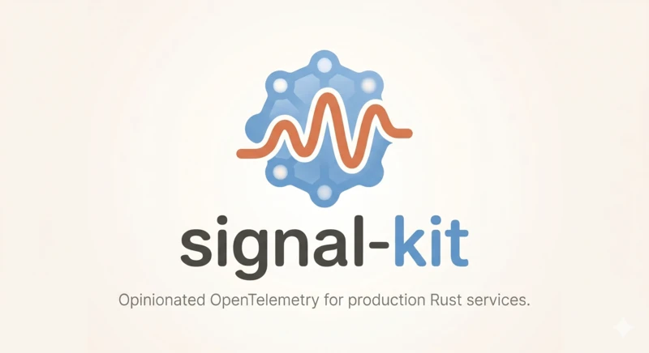

<p align="center">
  
</p>

<h1 align="center">signal-kit</h1>

<p align="center">
  <strong>Opinionated OpenTelemetry for production Rust services.</strong>
</p>

<p align="center">
  <a href="#quick-start">Quick Start</a> · <a href="#your-tracing-code-doesnt-change">Drop-in</a> · <a href="#configuration">Configuration</a> · <a href="#features">Features</a> · <a href="#examples">Examples</a>
</p>

---

`signal-kit` wires up traces, metrics, and logs in one builder call. It defaults to sensible choices (Tokio, `tracing`, OTLP/gRPC) and gets out of your way.

```rust
use signal_kit::ObservabilityBuilder;

#[tokio::main]
async fn main() -> anyhow::Result<()> {
    let _guard = ObservabilityBuilder::new("my-service")
        .with_attribute("version", env!("CARGO_PKG_VERSION"))
        .init()?;

    // traces, metrics, and logs are all wired up
    tracing::info!("service started");
    Ok(())
}
```

Hold the returned [`OtelGuard`] — when it drops, providers flush and shut down cleanly.

## Quick Start

Add to your `Cargo.toml`:

```toml
[dependencies]
signal-kit = "0.1"
```

Then in `main`:

```rust
// Production — returns Result
let _guard = signal_kit::try_init("my-service")?;

// Examples and tools — panics on failure
let _guard = signal_kit::init("my-service");
```

Set the OTLP endpoint and you're exporting:

```sh
export OTEL_EXPORTER_OTLP_ENDPOINT=http://localhost:4317
```

## Your `tracing` code doesn't change

signal-kit never wraps or replaces the `tracing` facade. It installs a process-global subscriber — a standard `tracing-subscriber` registry with one OpenTelemetry layer per signal — and every call site keeps working exactly as before:

- `tracing::info!`, `tracing::error!`, … with structured fields
- `#[tracing::instrument]` and explicit spans (`info_span!`, `Instrument::instrument`)
- Metric events: fields named `counter.*`, `gauge.*`, `histogram.*`, or `monotonic_counter.*` become OpenTelemetry metrics, so even metrics can stay `tracing`-native (`with_metrics_callback` for raw OTel instruments is optional)
- Any dependency crate that already emits `tracing` events — it lights up automatically, because the subscriber is global

There's nothing to re-export, no signal-kit macros, and no wrappers — `tracing` crates see the plain `tracing` API they were compiled against.

The one constraint: signal-kit owns the global subscriber. Initialise it once at the top of `main`, before anything else sets a default — `init`/`try_init` returns [`SubscriberAlreadyInitialised`](https://docs.rs/signal-kit/latest/signal_kit/enum.OtelInitError.html#variant.SubscriberAlreadyInitialised) otherwise.

Proof by example — [`examples/tracing-facade-unchanged.rs`](crates/signal-kit/examples/tracing-facade-unchanged.rs) is written exactly as it would be without signal-kit: every span, event, and metric comes from the plain `tracing` crate (including the `payment_service` module standing in for a signal-kit-unaware dependency), and the only signal-kit call is a single `init`:

```sh
cargo run -p signal-kit --example tracing-facade-unchanged
```

```text
2026-08-14T08:36:13.426023Z  INFO checkout{user="u-123"}: tracing_facade_unchanged: starting checkout
2026-08-14T08:36:13.426065Z  INFO checkout{user="u-123"}:charge{order_id=42}: tracing_facade_unchanged::payment_service: charging card amount_cents=2500
2026-08-14T08:36:13.426087Z  INFO checkout{user="u-123"}:charge{order_id=42}:gateway_call: tracing_facade_unchanged::payment_service: gateway approved
```

Run it with `OTEL_EXPORTER_OTLP_ENDPOINT` set and the same untouched calls export via OTLP instead — spans pick up trace IDs (`trace_id=…` appears in the output), and metric events flow to the collector.

## Configuration

Everything is optional. Set `OTEL_EXPORTER_OTLP_ENDPOINT` to enable export; leave it unset for local development (stdout only).

### Environment variables

`signal-kit` follows OpenTelemetry conventions — signal-specific endpoints take precedence over the general one:

| Variable | Purpose |
|---|---|
| `OTEL_EXPORTER_OTLP_ENDPOINT` | General OTLP endpoint |
| `OTEL_EXPORTER_OTLP_TRACES_ENDPOINT` | Traces-specific endpoint (overrides general) |
| `OTEL_EXPORTER_OTLP_METRICS_ENDPOINT` | Metrics-specific endpoint (overrides general) |
| `OTEL_EXPORTER_OTLP_LOGS_ENDPOINT` | Logs-specific endpoint (overrides general) |
| `RUST_LOG` | Log level filter (defaults to `info`) |

Crate-specific variables are namespaced under `SIGNAL_KIT_`:

| Variable | Default | Purpose |
|---|---|---|
| `SIGNAL_KIT_STRUCTURED_LOGGING` | `false` | JSON stdout output |
| `SIGNAL_KIT_FILE_ENABLED` | `false` | Enable file logging |
| `SIGNAL_KIT_FILE_PATH` | — | Log file path |
| `SIGNAL_KIT_FILE_ROTATION` | `daily` | `daily`, `hourly`, or `never` |
| `SIGNAL_KIT_FILE_RETENTION_DAYS` | `7` | Days to keep rotated logs |

### Resource attributes

Resource attributes are resolved in order: explicit builder attributes, `OTEL_RESOURCE_ATTRIBUTES`, crate convenience aliases (`ENVIRONMENT`, `CLOUD_*`, `KUBERNETES_*`), then compile-time metadata (`GIT_COMMIT`, `GIT_BRANCH`, etc.).

## Features

Default features: `traces`, `metrics`, `fmt`, `grpc-tonic`, `tls-roots`.

| Feature | Description |
|---|---|
| `traces` | OTLP trace export via `tracing-opentelemetry` |
| `metrics` | OTLP metric export with periodic reader |
| `fmt` | Stdout log output (pretty or JSON) |
| `json` | JSON-formatted stdout by default |
| `logs-otlp` | OTLP log export |
| `file-logging` | Rotating file log appender |
| `system` | System-level metrics (CPU, memory, disk, network) |
| `process` | Process-level metrics |
| `http` | HTTP request metrics with Tower middleware |
| `grpc-tonic` | gRPC transport via tonic (default) |
| `http-proto` | HTTP/protobuf transport |
| `tls` | TLS support |
| `tls-roots` | Native TLS root certificates (default) |
| `tls-webpki-roots` | WebPKI root certificates |

## Examples

### Custom resource attributes

```rust
let _guard = ObservabilityBuilder::new("my-service")
    .with_attribute("version", env!("CARGO_PKG_VERSION"))
    .with_attribute("environment", "production")
    .init()?;
```

### Custom metrics

```rust
let _guard = ObservabilityBuilder::new("my-service")
    .with_metrics_callback(|ctx| {
        let meter = ctx.meter();
        let counter = meter.u64_counter("requests.total").build();
        // store counter in your app state
        Ok(())
    })
    .init()?;
```

### File logging with rotation

```rust
use signal_kit::{FileLoggingConfig, ObservabilityBuilder, RotationConfig};

let file_config = FileLoggingConfig::builder()
    .enabled(true)
    .file_path("/var/log/myapp/service.log")
    .rotation(RotationConfig::daily())
    .build()?;

let _guard = ObservabilityBuilder::new("my-service")
    .with_file_logging(file_config)
    .init()?;
```

Rotation strategies: `Daily` (`service.2026-01-17`), `Hourly` (`service.2026-01-17.14`), `Never` (single file).

### Structured JSON stdout

```rust
let _guard = ObservabilityBuilder::new("my-service")
    .with_structured_stdout_logging()
    .init()?;
```

Or set `SIGNAL_KIT_STRUCTURED_LOGGING=true`.

## How it works

1. Builds an OpenTelemetry `Resource` with your service name and attributes
2. Creates trace, metric, and log providers with OTLP exporters (when an endpoint is configured)
3. Wires everything into a `tracing` subscriber — one layer per signal
4. Returns an `OtelGuard` that holds providers alive and flushes on drop

If no OTLP endpoint is set, exporters are skipped — you get local stdout logging with no network dependency. Perfect for development and tests.

## Supply chain & security

signal-kit is **published to crates.io** via release-plz. Each release also ships a packaged `.crate`, CycloneDX SBOMs, SHA-256 checksums, and GitHub build-provenance + SBOM attestations as GitHub Release assets. Dependencies are gated by `cargo-deny` (policy) and scanned with `cargo-audit` (RustSec) on every PR and at release time.

Run the checks locally:

```sh
just security          # cargo-deny + cargo-audit gate
just test-supply-chain # release-identity / SBOM / gate self-tests
just sbom              # generate the canonical CycloneDX SBOM
just sbom-validate     # validate it against the CycloneDX schema
```

See [SECURITY.md](SECURITY.md) for the full policy, exact release identity, SBOM scope, advisory policy, crates.io publishing, required branch check, and how to verify checksums, build provenance, and SBOM attestations. Maintainers should also see [docs/MAINTAINERS.md](docs/MAINTAINERS.md) for release-operation and recovery procedures.

## License

MIT OR Apache-2.0
